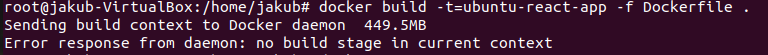

# Metodyki DevOps

# Wybranie odpowiedniego projektu

Do wykonania ćwiczenia wykorzystano następujące repozytorium zawierające mechanizm budowania oraz testy jednostkowe:

- https://github.com/jterkalski/react-app

# Uruchomienie kontenera

1. Pobieram obraz ubuntu za pomocą komendy: `docker pull ubuntu` 
   
2. Uruchamiam ubuntu używając: `docker run ubuntu` oraz sprawdzam status przy pomocy `docker ps -a` 
   
3. Ponieważ kontener posiada status "Exited", używam komendy `docker run -dt ubuntu` z flagą detached aby uruchomić kontenener ponownie, tym razem w tle. 
   
4. Następnie używam `docker container prune` aby wyczyścić wszystkie niedziałające w danym momencie kontenery (ze statusem "Exited"). 
   
5. Sprawdzam status 
   

# Budowanie programu

1. Teraz, gdy kontener działa już poprawnie, wchodzę na niego używając komendy `docker exec -it <id-kontenera> bash` 
   

2. Aktualizuję paczki za pomocę komend update oraz upgrade: `apt-get update && apt-get upgrade` 
   

3. Następnie instaluję Node.js komendą `apt-get install nodejs` 
    
    

4. Installuję npm: `apt-get install npm` 
    

5. Sprawdzam czy zostały poprawnie zainstalowane poprzez sprawdzenie wersji 
    

6. Installuję git'a: `apt-get install git` 
    

7. Klonuje repozytorium używając `git clone` 
    

8. Przechodzę do katalogu z projektem (`cd react-app`), a następnie za pomocą `npm install` instaluje niezbędne do działania programu moduły (node_modules) 
    

9. Buduję program za pomocą `npm run build`, lecz nie udaje się go odpalić 
    

10. Doinstalowuje curl: `sudo apt install curl`, a następnie aktualizuję node'a do wersji v14.x 
     

11. Przy pomocy curl aktualizuje Node do wersji v14.x 

- `curl -sL https://deb.nodesource.com/setup_14.x | bash -`
- `apt install -y nodejs` 
   
   

12. Po zaktualizowaniu Node'a udaje się zbudować program 
     

13. Uruchamiam testy za pomocą `npm run test`, podczas uruchamiania pojawia się okno dialogowę, w tym momencie należy kliknąć "a" aby uruchomić wszystkie możliwe testy. 
     
     
     

# Tworzenie Dockerfile i budowanie obrazu

1. Stworzyłem nowy plik Dockerfile przy użyciu komendy `touch Dockerfile` 
    

2. Następnie, aby edytować plik zainstalowałem edytory tekstu (vim oraz nano) 
    

3. Przy użyciu nano edytowałem Dockerfile 
    

4. Po edycji i zapisaniu treść Dockerfile przedstawiała się w następujący sposób: 
    

5. Po wykonaniu wcześniejszych 2 kroków, zorientowałem się że wciąż znajduję się w kontenerze, więc wyszedłem z niego za pomocą komendy `exit`, a następnie powtórzyłem ostatnie dwa kroki. 
    

6. Następnie zbudowałem obraz używając `docker build -t=ubuntu-react-app -f Dockerfile .` gdzie **ubuntu-react-app** jest nazwą obrazu po zbudowaniu, a **Dockerfile** to wcześniej stworzony dockerfile. 
   Otrzymałem następujący błąd: 
    

7. Błąd ten był spowodowany błędami w Dockerfile, które zostały naprawione w następujący sposób: 
    

8. Po naprawieniu błędów, udało się pomyślnie zbudować obraz. 
    
    

9. Tworzę Dockerfile dla testów na bazie poprzedniego obrazu. Analogicznie jak wczesniej używam komend: 

- `touch Dockerfile-test` 
- `nano Dockerfile-test` 
   
   

10. Po utworzeniu **Dockerfile-test** buduję za jego pomocą obraz  **ubuntu-react-app-test** używając `docker build -t=ubuntu-react-app-test -f Dockerfile-test .` i przedstawiam wynik 

     

# Uruchormienie obrazów

1. Uruchomienie obrazu **ubuntu-react-app** za pomocą `docker run ubuntu-react-app` 

    

2. Uruchomienie obrazu **ubuntu-react-app-test** za pomocą `docker run ubuntu-react-app-test` 

    

# Uruchamianie i wykorzystywanie programu na zewnątrz kontenera

1. Tworzę nowy dockerfile **Dockerfile2** do uruchomienia aplikacji, na bazie istniejącego już głównego **Dockerfile** 

    

2. Tworzę obraz **ubuntu-react-app2** wykorzystując nowo utworzony **Dockerfile2** za pomocą komendy: `docker build -t ubuntu-react-app2 -f Dockerfile2 .` 

    

3. Ponieważ projekt defaultowo uruchamia się na porcie 3000, uruchamiam obraz z przekierowaniem portu "na zewnątrz" na port 5000 używając komendy:
   `docker run -it -p 5000:3000 ubuntu-react-app2` 

    

   Na załączonym obrazie widzimy, że program zostaje uruchomiony wewnątrz kontenera, na localhost:3000, jednak po przekierowaniu jest widoczny na zewnątrz na porcie 5000. 

# Tworzenie kompozycji

1. Tworzę plik **docker-compose.yml** 
    

2. Pobieram docker-compose za pomocą `apt install docker-compose` 
    

3. Uruchamiam komendą `docker-compose up` 

    

4. Widzimy, że program działa, testy przechodzą, więc możemy wyłączyć używając **ctrl+C** 

    

## Czy dystrybuowanie wybranego oprogramowania w postaci kontenera ma sens?

Konteneryzacja tego typu oprogramowania ułatwia łączenie małych, niezależnych usług oraz pomaga wyeliminować błędy specyficzne dla środowiska poprzez możliwość lokalnego zreplikowania środowiska produkcyjnego.
Kolejnym plusem są dockerfile, dzięki którym inny programista może szybko uruchomić dany projekt nie martwiąc się o przygotowanie go i konfigurację.
Dystrybuowanie tego typu oprogramowania ma sens na pewno w przypadku, gdy chcemy użyć specyficznej wersji node'a. Dodatkowo biblioteka react-router używa backendu.

## Umotywować wybór (wewnątrz / na zewnątrz)

Ponieważ jest to projekt front-endowy uruchomienie go jedynie wewnątrz kontenera nie miałoby większego sensu. Na zewnątrz kontenera mamy możliwość wglądu w projekt w przeglądarce (tak jak wyżej zaprezentowano na przykładzie Mozilli Firefox).

 

# Instalacja Jenkinsa w środowisku linuksowym z wykorzystaniem Dockera

1. Wykorzystuję do tego instrukcję: https://www.jenkins.io/doc/book/installing/docker/ 

2. Tworzę bridge network używając komendy `docker network create jenkins` 
    

3. Następnie używam komend z instrukcji: 
    
    
    

   Sprawdzam obrazy i kontenery: 
    

4. Kolejnym punktem z instrukcji było stworzenie Dockerfile 
    

5. Z Utworzonego wcześniej **Dockerfile-Jenkins** buduję obraz Blueocean jako kontener komendą:  
   `docker build -t myjenkins-blueocean:2.319.3-1 -f Dockerfile-Jenkins .` 
    

6. Uruchamiam obraz poleceniami przekopiowanymi z instrukcji na stronie: 
    

   Sprawdzam obrazy i kontenery: 
    

7. Wchodzę do kontenera za pomocą: `docker exec -it jenkins-blueocean bash` 
    
    

8. Uzyskuję hasło administratora i loguję się nim 
    

   Po zalogowaniu 
    

9. Po utworzeniu konta admina: 
    
